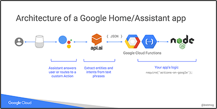

# Google Home workshop

## Slides

[Slides](https://bretmcg.com/talks/google-home)
|
[Video](http://www.nodesummit.com/prior-video/node-summit-2017-google-sponsor-workshop-build-a-chatbot-for-google-assistant-google-home-and-more-bret-mcgowen/)

## Instructions
### Steps
1. Use the [Actions on Google Console](https://console.actions.google.com) to add a new project with a name of your choosing.
1. Click *Use API.AI* and then *Create Actions on API.AI* to open the API.AI console.
1. Click *Save* to save the project.
1. Click on the gear icon to see the project settings.
1. Deploy the fulfillment webhook provided in the `src/yoda-bot` folder using [Google Cloud Functions](https://cloud.google.com/functions/):
    1. Create a [Google Cloud Platform](https://cloud.google.com) project if you don't already have one.
    1. Create a [Cloud Storage Bucket](https://console.cloud.google.com/storage/) to store your source code when deploying to Cloud Functions. Add this value to `src/yoda-bot/deploy.sh` if you wish to use this deploy script.
    1. Install the [gcloud command line utility](https://cloud.google.com/sdk/downloads).
    1. From `src/yoda-bot` deploy using `src/yoda-bot/deploy.sh` or using
    `$ gcloud beta functions deploy yodabot --trigger-http --stage-bucket [YOUR_STORAGE_BUCKETNAME]`    
1. Go back to the API.AI console and select *Fulfillment* from the left navigation menu. Enable *Webhook*, set the value of *URL* to the `Function URL` from the previous step (should look something like `https://us-central1-your-project.cloudfunctions.net/yodabot`, then click *Save*.
1. In the API.API console:
    1. Create an *Intent* named `math.add` with the Action Name of `math.add`.
     g   1. Under *User Says* enter "what is 10 plus 6"
        1. Mark the 10 as `number1` with entity type `@sys.number`
        1. Mark the 6 as `number2` with entity type `@sys.number`
        1. Under *Fulfillment* mark *Use webhook*
    1. Create an *Intent* named `yoda.translate` with the Action Name of `yoda.translate`.
        1. Under *User Says* enter "translate hello world to Yodish"
        1. Mark `hello world` as `phrase` with entity type `@sys.any`
        1. Under *Fulfillment* mark *Use webhook*
1. Select *Integrations* from the left navigation menu and open the *Settings* menu for Actions on Google.
1. Enter the following intents as *Additional triggering intents*
    * `math.add`
    * `yoda.translate`
1. Click *Test*.
1. Click *View* to open the Actions on Google simulator.
1. Type `Talk to my test app` in the simulator, or say `OK Google, talk to my test app` to any Actions on Google enabled device signed into your developer account.

For more detailed information on deployment, see the [documentation](https://developers.google.com/actions/samples/).

## Questions?
Ask Bret on Twitter at [@bretmcg](https://twitter.com/bretmcg).

## How to make contributions?
Please read and follow the steps in the [CONTRIBUTING.md](CONTRIBUTING.md).

## License
See [LICENSE](LICENSE).
